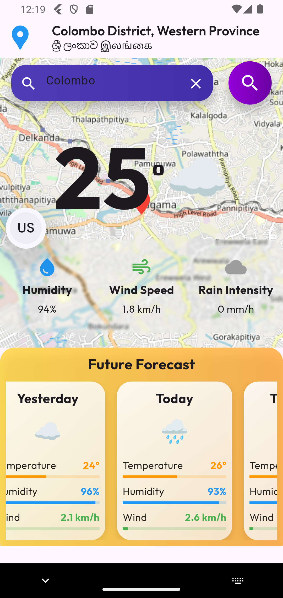
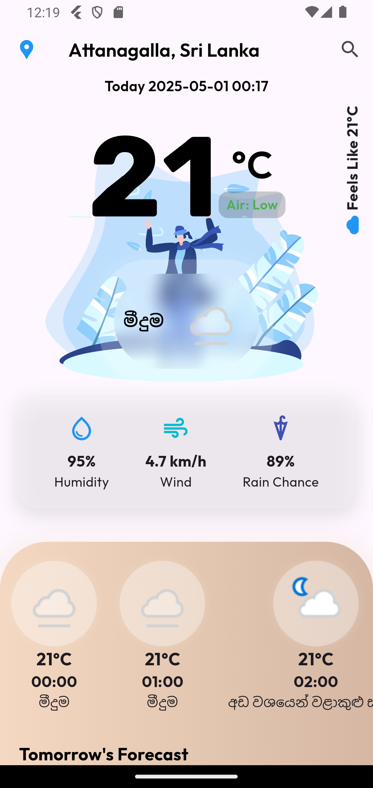

# 🌦️ WeatherNow - Flutter Weather App

## Description 🌟
This is a Flutter-based weather application that provides real-time weather updates and forecasts. The app uses APIs from [WeatherAPI](https://www.weatherapi.com/) 🌍 and [Tomorrow.io](https://www.tomorrow.io/weather-api/) 🌐 to fetch weather data. 🌡️💨☀️

| Colombo Weather | Attanagalla Weather |
|-----------------|---------------------|
|  |  |


## ✨ Features

- 🌍 Real-time weather updates for any location worldwide
- 🔍 Search functionality to find weather by city or district name
- 🌡️ Current temperature, humidity, wind speed, and rain intensity
- ☔ Rain chance predictions and air quality information
- 📊 Historical weather data comparison (yesterday vs today)
- 📅 Hourly and daily weather forecasts
- 📱 Beautiful UI with custom animations and illustrations
- 🌙 Dynamic backgrounds based on weather conditions and time of day
- 🔔 Weather alerts and notifications
- 📍 GPS integration for local weather

## 🛠️ Technologies Used

- **Flutter**: UI framework for cross-platform development
- **http**: HTTP client for API integration
- **Geolocator**: For getting device location
- **WeatherAPI.com**: Primary weather data source
- **Tomorrow.io API**: Additional weather metrics and forecasts
- **Lottie**: For weather animations

## 🚀 Getting Started

### Prerequisites

- Flutter (v3.0+)
- Dart (v2.17+)
- API keys from [WeatherAPI.com](https://www.weatherapi.com/) and [Tomorrow.io](https://www.tomorrow.io/weather-api/)

### Installation

1. Clone the repository:
   ```bash
   git clone https://github.com/DPramuditha/Flutter-Weather-App.git
   ```

2. Navigate to the project directory:
   ```bash
   cd weather_app
   ```

3. Install dependencies:
   ```bash
   flutter pub get
   ```

4. Create a `.env` file in the project root and add your API keys:
   ```
   WEATHER_API_KEY=your_weatherapi_key
   TOMORROW_IO_API_KEY=your_tomorrow_io_key
   ```

5. Run the app:
   ```bash
   flutter run
   ```

## Contributing 🤝
Contributions are welcome! Please fork the repository and submit a pull request. 🙌💡✨

## License 📜
This project is licensed under the MIT License. 📄✅

## Acknowledgments 🙏
- Thanks to [WeatherAPI](https://www.weatherapi.com/) 🌍 and [Tomorrow.io](https://www.tomorrow.io/weather-api/) 🌐 for providing weather data. 🙌🎉

## 📧 Contact

If you have any questions or feedback, please reach out:

- Email: 
- GitHub: [Dpramuditha](https://github.com/DPramuditha)

---

⭐ Star this repo if you found it useful! ⭐
